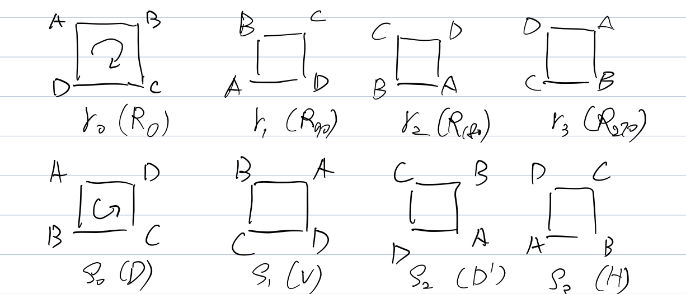

# 1. Groups

Informally, a group is a set in which we can “multiply” and “divide”.

## First Examples

### $(\mathbb{Z}, +)$

The integers $\{ ..., -2, -1, 0, 1, 2, ...\}$ form a group under addition.

1. $+$ takes two elements of $\mathbb{Z}$ and spits out another element of $\mathbb{Z}$. We say $\mathbb{Z}$ is **closed** under $+$.
    - e.g. $1+1=2$, $2+3=5$, $(-1)+1=0$, ...
2. $0$ is special. $0+a=a$ and $a+0=a$ for any $a \in \mathbb{Z}$. We say $0$ is the **identity** of $(\mathbb{Z},+)$.
    - Are there other identity in $(\mathbb{Z},+)$?
3. $a$ and $-a$ have a special relationship. $a+(-a)=0$ where $0$ is the identity. We say $a$  and $-a$ are the **inverse** of each other.
4. $+$ is **associative**. $(a+b)+c=a+(b+c)$
5. $+$ is commutative. $a+b=b+a$. We say $(\mathbb{Z}, +)$ is a commutative, or **Abelian** group.

### $(\mathbb{Q},+)$

The rational numbers under $+$ form a group.

1. $+$ takes two rational number and spits out another.
2. Identity is again $0$.
3. Inverse of $\frac{a}{b}$ is $-\frac{a}{b}$
4. $+$ is still associative.
   $$(\frac{a}{b} + \frac{c}{d}) + \frac{e}{f} = \frac{a}{b} + (\frac{c}{d} + \frac{e}{f})$$
5. $+$ is commutative.
   $$\frac{a}{b} + \frac{c}{d} = \frac{ad+bc}{bd} = \frac{c}{d} + \frac{a}{b}$$
   We say $(\mathbb{Q},+)$ is a Abelian group.

### $(\mathbb{Q}^*, \times)$

Q: Is $(\mathbb{Q}, \times)$ a group?

- Closed? Yes. $\frac{a}{b} \times \frac{c}{d} = \frac{ac}{bd}$
- Identity? $1$. $\frac{a}{b} \times 1 = \frac{a}{b}$
- Inverse?
	- $0 \times \frac{a}{b} = 1$, then $\frac{a}{b}=?$. $0$ does not have a inverse!
- Associative? Yes.
  $(\frac{a}{b} \times \frac{c}{d}) \times \frac{e}{f} = \frac{a}{b} \times (\frac{c}{d} \times \frac{e}{f})$
- Abelian? Yes.
  $\frac{a}{b} \times \frac{c}{d} = \frac{c}{d} \times \frac{a}{b}$

Consider $\mathbb{Q}^* = \mathbb{Q} \setminus \{0\}$, then every $\frac{a}{b} \in \mathbb{Q}$ has an inverse $\frac{b}{a}$ now.

### $(\mathbb{R}^*, \times)$

$\mathbb{R}^* = \mathbb{R} \setminus \{0\}$. The non-zero real numbers form a group under $\times$.

- Closed? Yes.
- Identity: $1$.
- Inverse: $\frac{1}{a}$
- Associative? Yes.
- Abelian? Yes.

### $(\mathbb{C}^*,\times)$

$\mathbb{C}^* = \mathbb{C} \setminus \{0+0i\}$. Non-zero complex numbers form a group under $\times$.

### $(\mathbb{Z},\times)$

Q: Can we do the same thing with $\mathbb{Z}$?

We have to throw more elements away. e.g. $2 \times a \neq 1$. In fact, we have to throw out everything except $1$ and $-1$. Thus, $\mathbb{Z}^* = \{1, -1\}$.

This group is small, so we can write down the structure in a table.

| $\times$ | $1$  | $-1$ |
|:--------:|:----:|:----:|
| $1$      | $1$  | $-1$ |
| $-1$     | $-1$ | $1$  |

This table is called the **Cayley table** of the group. We can make Cayley table for any finite group. We can list the group elements along the top and left.

| $\cdot$ | $g_1$ | $g_2$ | $...$ | $g_n$ |
|:-------:|:-----:|:-----:|:-----:|:-----:|
| $g_1$   |       |       |       |       |
| $g_2$   |       |       |       |       |
| $...$   |       |       |       |       |
| $g_n$   |       |       |       |       |

### $(GL_n(\mathbb{R}), \cdot)$

All $n \times n$ invertible matrixes form a group under matrix multiplication. GL stands for general linear. $GL_n(\mathbb{R}) = \{A \in \mathbb{R}^{n \times n} : det(A) \neq 0 \}$.

- Closed? Yes. $det(AB) = det(A) det(B) \neq 0$
- Identity: $I = \begin{bmatrix} 1 & 0 \\ 0 & 1 \end{bmatrix}$. $AI=IA=A$
- Inverse: $AA^{-1} = I$
- Associative? Yes. $(AB)C=A(BC)$ by linear algebra theorem.
- Abelian? No. $AB \neq BA$, so it is NOT an Abelian group.

## Definition

Formally, what is a group?

Definition - Group
: A **Group** is a set $G$ together with a binary operation $\cdot : G \times G \to G$ satisfies:   
1. $\cdot$ is associative. $\forall a, b, c \in G \; (a \cdot b) \cdot c = a \cdot (b \cdot c)$.   
2. $G$ contains an element $e$ such that $\forall a \in G \; a \cdot e = e \cdot a = a$.   
3. For any element $a \in G$, there exists an element $a^{-1} \in G$ such that $a \cdot a^{-1} = a^{-1} \cdot a = e$.

Note we are implicitly saying that a group is closed under the operation by writing $\cdot : G \times G \to G$.

Let $a, b \in G$. We say $a$, $b$ are commutative under operation $\cdot$ if $a \cdot b = b \cdot a$

A commutative, or **Abelian** group is a group such that $\forall a,b \in G \; a \cdot b = b \cdot a$.

Definition - Order
: The **order** of group $G$ is the number of elements in $G$,
	denoted by $|G|$.

For example,

1. $\mathbb{Z,Q,R,C}$ have infinite order.
2. $|\{1,i,-1,-i\}| = 4$
3. $|\mathbb{Z}^*| = 2$

## Properties of Groups

Let $G$ be a group under operation $\cdot$. Then the following properties hold.

Proposition 1.1
: The identity element $e \in G$ is unique.

> Proof:   
> Suppose there are two identities $e, f \in G$.
> Then $e = e \cdot f = f \cdot e = f$.
> Hence $e=f$ is unique.

Proposition 1.2
: If $a \in G$, then the inverse of $a$, $a^{-1}$ is unique.

> Proof:   
> Suppose $a \cdots b = b \cdots a = e$ and
> $a \cdot a = c \cdot a = e$.
> Then $c = c \cdot e = c \cdot (a \cdot b) =
> (c \cdot a) \cdot b = e \cdot b = b$.
> Hence $a^{-1} = c = b$ is unique.

Proposition 1.3
: If $a, b, c \in G$ and $ab = ac$, then $b=c$

> Proof:   
> Since $a$ has an inverse, $a^{-1} \in G$,
> $$\begin{aligned}
> ab &= ac  \\
> a^{-1}(ab) &= a^{-1}(ac)  & \text{inverse}  \\
> (a^{-1}a)b &= (a^{-1}a)c  & \text{associativity}  \\
> eb &= ec  & \text{inverse}  \\
> b &= c  & \text{identity}  \\
> \end{aligned}$$

Q: What is $(a^{-1})^{-1}$?
$$\begin{aligned}
(a^{-1})^{-1}
  &= (a^{-1})^{-1} \cdot e \\
	&= (a^{-1})^{-1} \cdot (a^{-1} \cdot a) \\
	&= ((a^{-1})^{-1} \cdot a^{-1}) \cdot a \\
	&= e \cdot a \\
  &= a \\
\end{aligned}$$

Definition - $a^n$
: If $a \in G$ and $n \in \mathbb{Z}$ then
	$$a^n = \begin{cases}
	a \cdot ...\cdot a \ \text{for n times} & n > 0 \\
	e & n = 0 \\
	a^{-1} \cdot ...\cdot a^{-1} \ \text{for -n times} & n < 0 \\
	\end{cases}$$

Proposition 1.4
: For any $m,n \in \mathbb{Z}$, $a^m \cdot a^n = a^{m+n}$,
  and $(a^m)^n = a^{mn}$

Remark: We usually write $a \cdot b$ as $ab$

## More Examples

### $(\mathbb{Z}_n, +)$

$\mathbb{Z}_n = \{[0], [1], ... ,[n-1]\}$ and $[a] = \{b \in \mathbb{Z} : n \mid b-a \}$. $[a]$ is the set of all integers with same remainder as $a$ after divided by $n$.

e.g. $\mathbb{Z}_3 = \{[0], [1], [2]\}$ where $[0] = \{0,3,6,9,...\}$, $[1] = \{1,4,7,10,...\}$, and $[2] = \{2,5,8,11,...\}$

We simply write $[a]$ as $a$, that is $\mathbb{Z}_3 = \{1,2,3\}$.

We know that for $[a], [b] \in \mathbb{Z}_n$, $[a] + [b] = [a+b] \mod n$.

e.g. $1+2=0 \mod 3$, $2+2=1 \mod 3$

With this operation, addition modulo $n$, elements in$\mathbb{Z}_n$ form a group.

e.g. $(\mathbb{Z}_3, +)$ 

| $+$ | $0$ | $1$ | $2$ |
|:---:|:---:|:---:|:---:|
| $0$ | $0$ | $1$ | $2$ |
| $1$ | $1$ | $2$ | $0$ |
| $2$ | $2$ | $0$ | $1$ |

- Closed? Yes
- Identity: $0$
- Inverse: $n-a$
- Associative? Yes
- Abelian? Yes
- Order: $n$

### $(\Z_n^*, \times)$

Can we turn $(\Z_n, +)$ into a multiplicative group? Consider $\Z_4={0, 1, 2, 3}$. The Cayley table looks like:

| $\times$ | $0$ | $1$ | $2$ | $3$ |
|:--------:|:---:|:---:|:---:|:---:|
| $0$      | $0$ | $0$ | $0$ | $0$ |
| $1$      | $0$ | $1$ | $2$ | $3$ |
| $2$      | $0$ | $2$ | $0$ | $2$ |
| $3$      | $0$ | $3$ | $2$ | $1$ |

From the table we observe that:

- The identity has to be $1$.
- $0$ and $2$ do not have inverses.
- $1$ and $3$ are fine.

> Why $[a] \times [b] = [ab] \mod n$?
> $$\begin{aligned}
> (q_1 n + r_1)(q_2 n + r_2)
> &= k_1 k_2 n^2 + k_1 r_2 n + k_2 r_1 n + r_1 r_2 \\
> &= s n + r_1 r_2 \\
> \end{aligned}$$

Corollary
: An integer $a$ has a solution to equation $ax = 1 \mod n$ if and only if $a$ and $n$ are coprime.

We can turn $\Z_n$ into a multiplicative group by keeping those coprime to $n$. Thus,
$$\begin{aligned}
\Z_n^*
&= \{a \in \Z_n : ax = 1 \mod n \; \exists x \in \Z_n \} \\
&= \{a \in \Z_n : gcd(a,n) = 1\} \\
\end{aligned}$$

e.g. $\Z_{12}^* = \{1, 5, 7, 11\}$ where $|\Z_{12}^*| = 4$

| $\times$ | $1$  | $5$  | $7$  | $11$ |
|:--------:|:----:|:----:|:----:|:----:|
| $1$      | $1$  | $5$  | $7$  | $11$ |
| $5$      | $5$  | $1$  | $11$ | $7$  |
| $7$      | $7$  | $11$ | $1$  | $5$  |
| $11$     | $11$ | $7$  | $5$  | $1$  |

e.g. $\Z_5^* = \{1, 2, 3, 4\}$ where $|\Z_5^*| = 4$

| $\times$ | $1$ | $2$ | $3$ | $4$ |
|:--------:|:---:|:---:|:---:|:---:|
| $1$      | $1$ | $2$ | $3$ | $4$ |
| $2$      | $2$ | $4$ | $1$ | $3$ |
| $3$      | $3$ | $1$ | $4$ | $5$ |
| $4$      | $4$ | $3$ | $2$ | $1$ |

- Closed? Yes
- Identity: $1$
- Inverse: $aa^{-1} = 1 \mod n$
- Associative? Yes
- Abelian? Yes
- Order: $\phi (n)$ - the Euler’s totient function.

### The Symmetric Group $S_n$

For each integer $n \ge 1$, define the symmetric group $S_n$ to be set of all permutations $\sigma: \{1,2,...,n\} \to \{1,2,...,n\}$. That is, $S_n = \{ \sigma : \{1,...,n\} \to \{1,...,n\}: \sigma \text{ is bijective}\}$.

e.g. Let $\sigma, \tau, \pi: \{1,2,3\} \to \{1,2,3\}$ and define

|     | $\sigma$ | $\tau$ | $\pi$ |
|:---:|:--------:|:------:|:-----:|
| $1$ | $2$      | $2$    | $2$   |
| $2$ | $1$      | $3$    | $3$   |
| $3$ | $3$      | $1$    | $2$   |

Then, $\sigma$ and $\tau$ are elements of $S_3$, but $\pi$ is NOT.

$S_n$ forms a group under $\cdot$, function composition.

e.g. Consider $\sigma \cdot \tau$

|     | $\sigma \cdot \tau$ |
|:---:|:-------------------:|
| $1$ | $1$                 |
| $2$ | $3$                 |
| $3$ | $2$                 |

A more compact way to write $\sigma$ and $\tau$ is to use an array.
$$\sigma = \begin{pmatrix} 1 & 2 & 3 \\ 2 & 1 & 3 \end{pmatrix} \qquad
\tau = \begin{pmatrix} 1 & 2 & 3 \\ 2 & 3 & 1 \end{pmatrix}$$
In general,
$$\pi = \begin{pmatrix} 1 & 2 & ... & n \\ \pi(1) & \pi(2) & ... & \pi(n) \end{pmatrix}$$

$(S_n, \cdot)$ is not Abelian for all $n \ge 3$. We already have $n=3$. To see $n > 3$, let $\sigma, \tau$ be permutations in $S_n$ that fix $4,5,..,n$ (i.e. $\sigma(4)=\tau(4)=4, ..., \sigma(n)=\tau(n)=n$). Since we know that these are permutations on $\{1,2,3\}$ that don’t commute, we can pick values for $\sigma(1), \sigma(2), \sigma(3), \tau(1), \tau(2), \tau(3)$ so that $\sigma$ and $\tau$ don’t commute.

What is the order of $S_n$? $|S_n| = n \times (n-1) \times ... \times 1 = n!$.

- Closed? Yes. _CHECK!_
- Identity: $e(x) = x$, the identity function.
- Inverse: $\sigma^{-1}$, the inverse function.
- Associative? Yes.
- Abelian? No, for all $n \ge 3$.
- Order: $n!$

### The Dihedral Group $D_n$

The set $D_n$ ($n \ge 3$) is the set of symmetries of a regular n-gon. Here a symmetry is any movement that can be comes to the object while you’re looking away, that you won’t know has happened. Let’s start by looking at $D_4$, the symmetries of a square $\Box$. We will put imaginary labels on the square to keep track of the symmetries.

There are at most $8$ symmetries ($|D_4|=8$). Why? We have 4 choice for the top-left corner (a fixed vertex), then 2 choices for the “direction” of A, B, C, D, (an orientation). In general, $|D_n| = 2n$.

What is operation on this group? Composition of symmetries (movements).

e.g.

- $R_0 R_0 = R_0$
- $R_{90} R_{90} = R_{180}$
- $DD’ = R_{180}$
- $R_{270}H=D’$
- $HR_{270}=D$.

$D_4$ can be built using just a $90 \degree$ counter-clockwise rotation (or clockwise) and a diagonal flip (or, vertical, horizontal). $D_4 = \{ R_{90}^k, R_{90}^k F: 0 \le k < 4\}$. In general, $D_n = \{ R^k, R^k F: 0 \le k < n\}$, where $R$ is the counter-clockwise $\frac{2\pi}{n}$ rotation and $F$ is the flip over a fixed axis. We sometimes denote $R^k = r_k$ and $R_k F = s_k$.

Some useful algebra:

1. $r_i r_j = r_{i+j}$
2. $r_i s_j = s_{i+j}$
3. $s_i r_j = s_{i-j}$
4. $s_i s_j = r_{i-j}$

$D_4$ is non-Abelian. $r_3 s_3 = s_2$, but $s_3 r_3 = s_0$. In general, $D_n$ is non-Abelian. (can you prove that?)

- Closed? Yes
- Identity: $r_0$
- Inverse: $s_i^{-1}=s_i$, $r_i^{-1} = r_{-i}$
- Associative? Yes
- Abelian? No, for all $n \ge 3$.
- Order: $2n$ 

## Direct Product

Definition - Direct Product
: Let $(G,*)$, $(H, \star)$ be groups. We define the direct product of $G$ and $H$ by $(G \times H, \cdot)$ where $$G \times H = \{(g,h) : g \in G, h \in H\}$$ and $$(g,h) \cdot (g’,h,) = (g * g’, h \star h’)$$.

e.g. $GL_2(\R) \times \Z_2$
$$(\begin{bmatrix}1 & 1 \\ 0 & 1 \end{bmatrix}, 0) \cdot (\begin{bmatrix}1 & 0 \\ 1 & 1\end{bmatrix}, 1) = (\begin{bmatrix} 2 & 1 \\ 1 & 1 \end{bmatrix}, 1)$$

