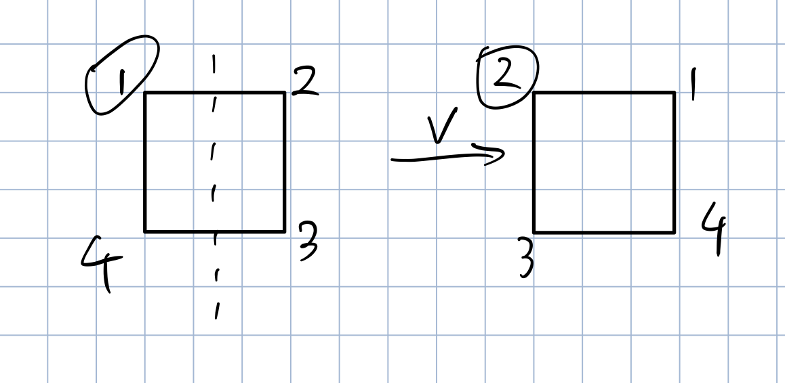
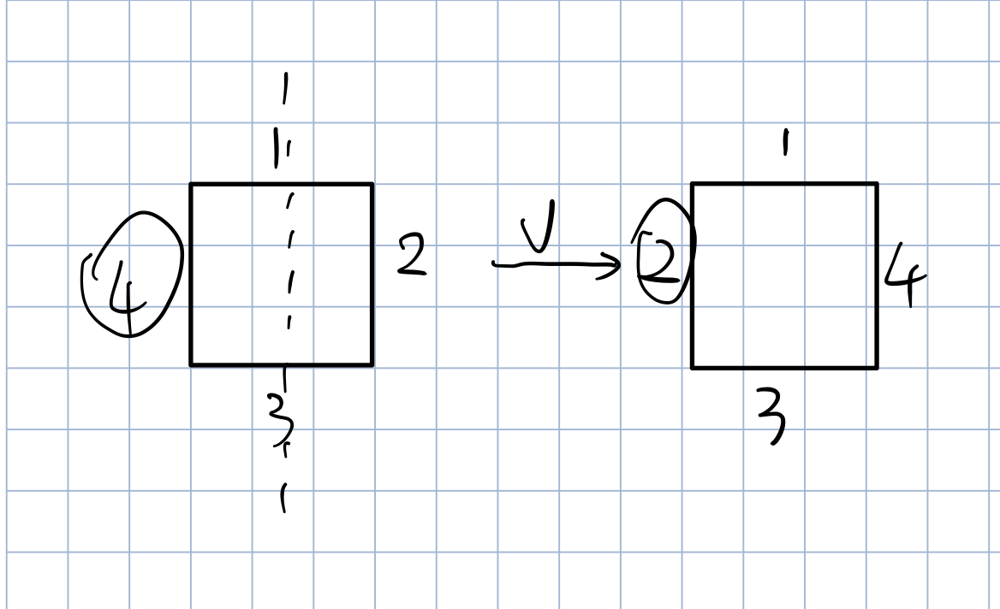
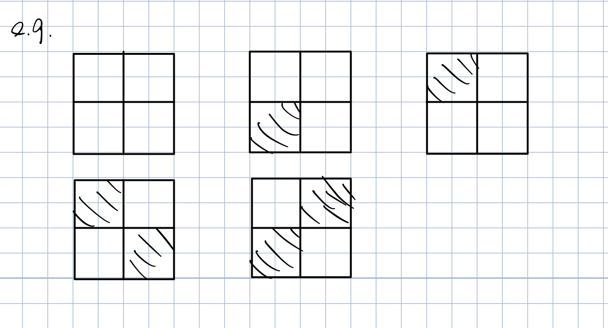
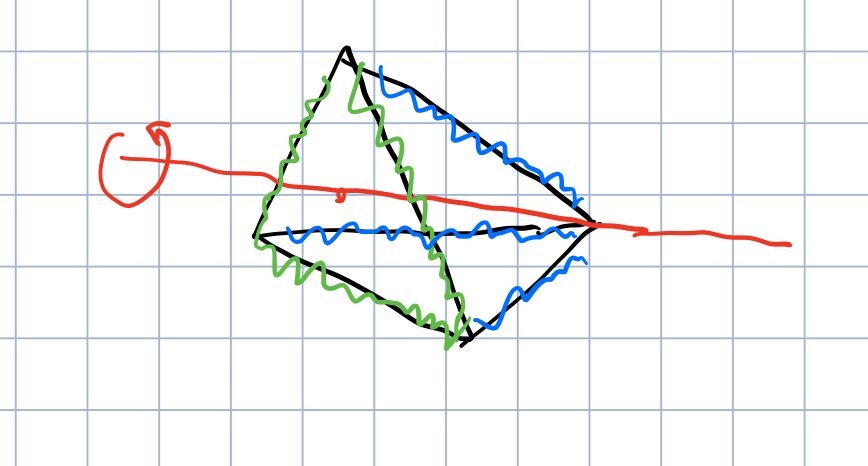
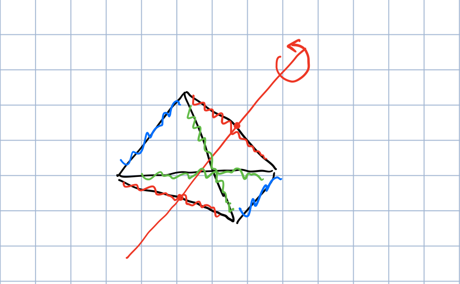

# Group Actions

(see Papantonopoulou, Chapter 4)

We can see the dull power of group theory by studying how a group acts on a set of objects.

e.g. Consider the group $G = GL_n(\R)$, and the set $X = \R_n$. The group $G$ acts on $X$ by multiplying a vector $x \in X$ by a matrix $A\in G$. Moreover, we can see the group structure of $GL_n(\R)$ in the action.

---

Up to now our study of groups has been largely focused on the groups themselves. Now we will see how a group $G$ can describe the symmetries of a set $X$. Essentially, we would like the group to permutations the elements of $X$ in a “structured” way.

For instance how should the group identity $e$ permute the elements of $X$? We would hope that $e$ does nothing to the elements of $X$.

It would also be reasonable to ask that for elements $g_1, g_2 \in G$, if we permute $X$ using $g_2$ and then permute using $g_1$, that this be same as permitting with the product $g_1 g_2$.

Definition - Group Action
: Let $G$ be a group and $X$ be a set. An action of $G$ on $X$ is map $\cdot: G \times X \to X$ that satisfied the following properties.  
1. $e\cdot x = x$ for all $x \in X$.  
2. Given $g_1 g_2 \in G$, then $g_1 \cdot (g_2 \cdot x) = (g_1 g_2) \cdot x$ for all $x \in X$.
: We write $G \curvearrowright X$ to indicate that $G$ is acting on $X$.

e.g.(1) Let $G = S_n$ and $X=\{1,2,...,n\}$. Then $G$ acts on $X$ in the natural way: given $\sigma \in S_n$ and $i \in X$, then $\sigma \cdot i = \sigma(i)$. Let’s check that this is an action.

1. $e \cdot i = e(i) = i$ for all $i \in X$
2. Given $\sigma, \tau \in S_n$ and $i \in X$, then $\sigma \cdot (\tau \cdot i) = \sigma \cdot \tau(i) = \sigma(\tau(i)) = (\sigma \circ \tau)(i) = (\sigma \circ \tau) \cdot i$.

e.g.(2) The group $G = GL_n(\R)$ acts on the set $\R^n$ by multiplication: given $A \in GL_n(\R)$ and $x \in \R^n$, then $A \cdot x= Ax$. Again we see that:

1. $I \cdot x = Ix = x$ for all $x \in \R^n$
2. If $A, B \in GL_n(\R)$, then $A\cdot (B \cdot x) = A \cdot (Bx) = A(Bx) = (AB)x = (AB) \cdot x$ for all $x \in \R^n$.

So this is indeed a action.

e.g.(3) The group $D_4$ acts on the set $X= \{1,2,3,4\}$ by thinking of the elements of $X$ as the corner of a square.

For instance if $v \in D_4$ is the vertical flip then $v \cdot 2 = 1$. 

We could also interpret this as the action of $D_4$ on the edges of the square.

e.g.(4) Let $G$ be a group and consider the set $X = G$ itself $G$ acts on $X$ be left multiplication. Given $a,b \in G$, we define $a \cdot b = ab$. Exercise: check this is an action.

e.g.(5) A group $G$ can act on itself (i.e. $X = G$) by conjugation. Given $a,b \in G$ then $a \cdot b = aba^{-1}$. To see that this is an action note that

1. $e \cdot a = eae^{-1} = a$ for all $a\in G$.
2. Let $a,b\in G$, then for $g \in G$, we have $a \cdot (b \cdot g)= a \cdot (bgb^{-1}) = a(bgb^{-1})a^{-1} = (ab)g(b^{-1}a^{-1}) = (ab) g(ab)^{-1} = (ab) \cdot g$.

Suppose $G$ is a group acting on a set $X$. Given $g \in G$, consider the map $\psi_g: X \to X$ such that $\psi_g(x) = g \cdot x$. This map is a bijection or permutations of $X$.

Indeed, given $x \in X$ we have that $\psi_x(g^{-1} \cdot x) = g \cdot (g^{-1} \cdot x) = (gg^{-1}) \cdot x = e \cdot x = x$. So it is surjective.

To see that $\psi_g$ is injective, suppose that $\psi_g(x) = \psi_g(y)$, then $g\cdot x = g \cdot y$, $g^{-1}\cdot(g \cdot x) = g^{-1}\cdot(g \cdot y)$, $(g^{-1}g) \cdot x = (g^{-1}g) \cdot y$, $e \cdot x = e \cdot y$, $x=y$.

This means that $\psi_g$ is bijective. Stated differently, $\psi_g$ belongs to $S_X = \{ \text{bijections} f: X \to X\}$.

Note: $S_X$ is a group under function composition. Furthermore if $|X| = n < \infty$, then $S_X \cong S_n$ (after all, both are permutations on a set of $n$ elements).

Now consider the map $\Phi: G \to S_X$ such that $\Phi(g) = \psi_g$. Turns out $\Phi$ is a homomorphism from $G$ to $S_X$. Indeed, we show that if $g_1, g_2 \in G$, then $\Phi(g_1 g_2) = \Phi(g_1) \circ \Phi(g_2)$ (i.e. $\psi_{g_1 g_2} = \psi_{g_1} \circ \psi_{g_2}$).

If $x \in X$, then
$$\psi_{g_1 g_2} = (g_1 g_2) \cdot x = g_1 \cdot (g_2 \cdot x) = g_1 \cdot (\psi_{g_2}(x)) = \psi_{g_1}(\psi_{g_2}(x)) = (\psi_{g_1}\circ\psi_{g_2})(x)$$
Thus $\psi_{g_1 g_2} = \psi_{g_1}\circ\psi_{g_2}$, i.e. $\Phi(g_1 g_2) = \Phi(g_1) \Phi(g_2)$. This shows an action $G \curvearrowright X$ gives rise to a homomorphism $\Phi: G \to S_X$.

---

Given an action $G \curvearrowright X$ and a group element $g \in G$, we proved that $\psi_g: X\to X$ such that $\psi_g(x) = g\cdot x$ is bijective.

In other words $\psi_g \in S_X = \{ f:X \to X : f \text{ is bijective}\}$. We showed that the map $\Phi: G \to S_X$ such that $\Phi(g) = \psi_g$ is a homomorphism. So every action $G \curvearrowright X$ gives rise to a homomorphism $\Phi: G \to S_X$.

Theorem 8.1 - Cayley Theorem
: Every group $G$ is isomorphic to a group of permutations. In particular, if $|G|=n < \infty$, then $G$ is isomorphic to a subgroup of $S_n$.

> Proof:
> 
> Consider the action of $G$ on itself by left multiplication: given $g \in G$ then $g \cdot a = ga$. Consider the homomorphism $\Phi: G \to S_G$ where $\Phi(g) = \psi_g$. Note: $g\in \ker \Phi \iff \psi_g$ is the identity of $S_G$, so
> $$\ker \Phi = \{ g \in G: \psi_g(a) = a \quad \forall a\in G \} = \{ g \in G : g \cdot a = a \quad \forall a\in G\} = \{g \in G : ga = a \quad \forall a\in G\} = \{e\}$$
> Thus, by the first isomorphism theorem $G/\ker \Phi \cong \im \Phi \le S_G$. So $G \cong \im \Phi$ which is a group of permutations. The final claim follows from the fact the $S_G \cong S_n$ when $|G| = n < \infty$.

## Orbits and Stabilizers

Let $G \curvearrowright X$ be a group action and fix $x \in X$.

- Where can we send $x$?
- Which elements of $G$ leave $x$ unchanged?

Definition - Orbit and Stabilizer
: Let $G \curvearrowleft X$ be a group action and fix $x \in X$. Define:  
1. The orbit of $x$ to be the set $\orb_x \{g \cdot x \in X: g \in G\}$.  
2. The stabilizers of $x$ to be the set $\stab_x = \{g \in G: g\cdot x =x\}$

Remark $\stab_x \subseteq G$ and $\orb_x \subseteq X$

Proposition 8.2
: If $G \curvearrowright X$ is a group action and $x \in X$, then $\stab_x \le G$.

Exercise: Prove proposition 8.2.

Note: $X$ may not be a group, so $\orb_x$ is not a subgroup of $X$.

### Example 1

Consider the action of $S_n$ on $X=\{1,...,n\}$ given by $\sigma \cdot i= \sigma(i)$. Fix $i\in X$.

The orbit $\orb_i = X$. You can send $i$ to anywhere. In particular, if $j\in X$, then $(i j)\cdot (i) = j$. 

The stabilizer $\stab_i = \{ \sigma \in S_n : \sigma(i) = i\} \cong S_{n-1}$.

### Example 2

Let $G = \{ e^{i\theta} : \theta \in \R \} \le \mathbb{C}^*$, the unit circle. And $X = \mathbb{C}$. $G$ acts on $X$ by multiplication: if $z \in \mathbb{C}$, then $e^{i\theta} \cdot z = e^{i\theta}z$. Fix $z\in \mathbb{C}$.

The orbit
$$\orb_z = \{ e^{i\theta}\cdot z: \theta \in \R\} = \{ e^{i\theta}z : \theta \in \R\} = \{w\in \mathbb{C} : |w| = |z|\}$$

The stabilizer: exercise

### Example 3

Let $G$ be the group of all rotations of a cube.

First, consider the action of $G$ on the set of all vertices of the cube. Let $v \in X$ be a particular vertex. What is $\orb_i$? What is $\stab_i$? Here $\orb_i = X$ (so $|\orb_i|=8$) also $|\stab_i|=3$

Second, consider the action of $G$ on the set of all edges of the cube. Pick a particular edge $E \in X$. Here $|\orb_E| = 12$ (i.e. all of $X$), and $|\stab_E| = 2$.

Last, consider the action of $G$ on the set of all faces of the cube. Choose any $F\in X$. Now $|\orb_F| = 6$ and $|\stab_F| = 4$.

In all cases, we saw that if $x \in X$ the $|\orb_x| \cdot |\stab_x| = 24$. It turns out that $24$ is the number of rotations in $G$. 

## Orbit-Stabilizer Theorem

Theorem 8.3 - Orbit-Stabilizer Theorem
: Let $G \curvearrowright X$ be a group action. Given any $x\in X$ then |G:\stab_x| = $\orb_x$. In particular, if $|G| < \infty$, then $|G|=|\stab_x| \cdot |\orb_x|$.

> Proof:
> 
> We claim that $|G/\stab_x| = |\orb_x|$.
> We must find a bijection $f: G/\stab_x \to \orb_x$.
> 
> Define $f: G/\stab_x \to \orb_X$ by $f(g\stab_x) = g \cdot x$.
> First, given $g_1, g_2 \in G$, then
> $$g_1 \stab_x = g_2 \stab_x \\
> \iff g_2^{-1}g_1 \in \stab_x \\
> \iff (g_2^{-1}g_1)\cdot x = x \\
> \iff g_1 \cdot x = g_2 \cdot x \\
> \iff f(g_1 \stab_x) = f(g_2 \stab_x)$$
> So $f$ is well-defined and injective.
>  
> Finally, given $y \in \orb_x$, we can write $y = g \cdot x$ for some
> $g \in G$. Thus, $f(g \stab_x) = g \cdot x = y$, so $f$ is surjective,
> and thus bijective as claimed.
> 
> The final statement is now immediate from Lagrange’s theorem.

e.g.
By the orbit-stabilizer theorem, there are indeed 24 rotational symmetries of a cube.

e.g.
How many rotational symmetries does a soccer ball have?

Let $G$ be the group of rotations of this soccer ball, and let $G$ act on the set of all the black pentagon faces $X$. Note that $|X| = 12$.

Given $x \in X$, $|\orb_x| = 12$ and $|\stab_x|=5$, by the orbit-stabilizer theorem, $|G| = 12 \times 5 = 60$.

e.g.
How many action does the group $G = \Z_5$ have on the set $X = \{1,2,3\}$?

Suppose $G \curvearrowright X$ is any action. Given $x \in X$, we know that $|\stab_x| \cdot |\orb_x| = |\Z_5| = 5$. Thus $|\orb_x| = 1, 5$. However $|X| = 3$ and $\orb_x \subseteq X$, it must be $|\orb_x| = 1$.
Thus $g\cdot x = x$ for all $g\in \Z_5$. Since we assumed that $x$ is any element in $X$, $g \cdot x = x$ for all $g \in G$ and $x \in X$, so there is only one action.

We call this the **trivial action**.

Exercise: How many rotational symmetries does a tetrahedron have? (pyramid with triangular base)

## Application of Group Actions

e.g.
How many $2\times 2$ chess boards can one build using black and white squares?

Naive answer: total of $2^4 = 16$ boards. (We can choose black or white for each of the 4 squares)

But wait... We should consider two boards to be the same if we can rotated one into the other:

Let $G$ be the rotational symmetry group of a square, and the $G$ acts on the set $X$ of all $2^4 = 16$ possible boards.
 
We consider two boards to be the same if they’re in the same orbit. So we want to know the number of orbit of this action.

We will accomplish this using Burnsides’s lemma, but first we need a proposition.

Proposition 8.4 - Orbit Partitioning
: If $G \curvearrowright X$ is a group action, then the orbits of the action partition $X$. That is:  
1. $X = \cup_{x\in X} \orb_x$, and  
2. Given $x,y \in X$ either $\orb_x = \orb_y$ or $\orb_x \cap \orb_y = \emptyset$

Lemma 8.5 - Burside’s Lemma
: Let $G$ be a finite group acting on a finite set $X$. Then the number of orbits of this action, denoted $N$, is given by
$$N = \frac{1}{|G|}\sum_{g\in G} |\fix(g)|$$
where $\fix(g) = \{x\in X : g\cdot x = x\}$

Back to our example, the group is $G = \{e, R_{90}, R_{180}, R_{270}\}$. For each $g\in G$, we commute $|\fix(g)|$.

1. $|\fix(e)| = 2^4$. All boards are fixed.
2. $|\fix(R_{90})| = 2$. Either all white or all black.
3. $|\fix(R_{270})| = 2$. Similar to (2).
4. $|\fix(R_{180})| = 2^2$. Both pairs of diagonal tiles have to be same. Choose one of two colors for each pair. 

Then by lemma 8.5, the number of board is $$N = \frac{1}{|G|}\sum_{g\in G}|\fix(g)| = \frac{1}{4} (16 + 2 + 2 + 4) = 6$$.

To prove lemma 8.5, we use the proposition 8.4.

> Proof:
> 
> Let $n$ be the number of pairs $(g,x) \in G \times X$ such that
> $g \cdot x = x$. Given a fixed $g \in G$, the number of such pairs
> $(g,x)$ is $|\fix(g)|$. Thus $n = \sum_{g\in G} |\fix(g)|$.
> 
> Alternatively, given $x \in X$ the number of such pairs $(g,x)$ is
> $|\stab_x|$, so
> $$n = \sum_{x\in X}|\stab_x| = \sum_{x \in X}\frac{|G|}{|\orb_x|} =
> |G| \sum_{x\in X}\frac{1}{\orb_x}$$
>
> By proposition 8.4, $X$ is the union of its disjoint orbits, so we can 
> sum over $1$ orbit at a time. Consider $\orb_x$. Given $y\in \orb_x$,
> we have $\orb_y = \orb_x$, and hence
> $$\sum_{y\in \orb_x} \frac{1}{|\orb_y|} = \frac{1}{|\orb_x|} + ... +
> \frac{1}{|\orb_x|} = \frac{|\orb_x|}{|\orb_x|} = 1$$
> Thus, 
> $$n = |G| \sum_{x\in X} \frac{1}{|\orb_x|} = |G|N$$
> and
> $$\sum_{g \in G} |\fix(g)| = n = |G|N$$
> $$N = \frac{1}{|G|}\sum_{g\in G} |\fix(g)|$$

### Solving Burnside Problems

1. Let $X$ be the set of objects ignoring symmetry.
2. Find a group to act on $X$ that describes the symmetries.
3. Use Burnside to find $N$, the number of orbits.

e.g.(1) How many 6-bead necklaces can be made using $3$ black beads and $3$ white beads?

1. Choose $3$ locations for the black beads in $\begin{pmatrix}6\\3\end{pmatrix} = 20$ ways. $|X| = 20$
2. Let $G = D_6$. We need to know the number of orbits when $G \curvearrowright X$.

	|$g$  |$\fix(g)$|
	|:---:|:-------:|
	|$r_0$|$20$|
	|$r_1$|$0$ |
	|$r_2$|$2$ |
	|$r_3$|$0$ |
	|$r_4$|$2$ |
	|$r_5$|$0$ |
	|$s_0$|$4$ |
	|$s_1$|$0$ |
	|$s_2$|$4$ |
	|$s_3$|$0$ |
	|$s_4$|$4$ |
	|$s_5$|$0$ |

3. Thus, $$N = \frac{1}{|D_6|}\sum_{g\in G}|\fix(g)| = \frac{1}{12} (20+2+2+4+4+4) = 3$$

e.g.(2) How many ways can one label the faces of a six-sided die using the numbers 1-6 exactly once?

1. Let $X$ be the set of all possible labelings of a cube using 1-6, ignoring symmetry. We choose one face for each number. $|X| = 6! = 720$.
2. Let $G$ be the group of rotation of a cube . By the orbit-stabilizer theorem $|G| = 24$. We want to know the number of orbits when $G \curvearrowright X$.
3. By Burnside, we must compute $|\fix(g)|$ for each $g \in G$. First, $|\fix(e)| = |X| = 720$. However, every other rotation will not fix some faces, and since all faces are distinct $|\fix(g)| = 0$ for any $g \ne e$.
4. Thus, $$N = \frac{1}{|G|}\sum_{g\in G}|\fix(g)| = \frac{720}{24} = 30$$

e.g.(3) How many ways can you color the edges of a tetrahedron using red, blue, and green?

1. Let $X$ be the set of all possible tetrahedra. We can pick any of 3 colors for each edge. $|X| = 3^6$
2. Let $G$ be the group of all rotations of the tetrahedron. By Orbit-Stabilizer, $|G| = 12$
3. What do the rotations in $G$ actually look like?
	- First, there are 1 identity $e$. $|\fix(e)| = 3^6$.
	- Then, for each face there are 2 rotations $\tau$ through the face and opposite vertex. For every such $\tau$, $|\fix(\tau)$ = 3^2$. In total there are $8$ such rotations. 
	- There are rotation $\sigma$ about an axis through two opposite edges. $|\fix(\sigma)| = 3^4$. There are $3$ such rotations in total. 
4. Thus, $$N = \frac{1}{12}(1\times 3^6 + 8 \times 3^2+ 3 \times 3^4) = 87$$

## Class Equation

Let $G$ be a finite group and let $G$ act on itself by conjugation $a \cdot b = aba^{-1}$.

Let $\orb_{g_1}, \orb_{g_2}, ..., \orb_{g_r}$ be the disjoint orbits of $G$ that are hot contained in $Z(G)$

Using proposition 8.4, one can prove that
$$|G| = |Z(G)| + \sum_{i=1}^{r}|G:\stab_{g_i}|$$

Note that
$$\begin{aligned}
\stab_{g_i}
&= \{ a \in G: a \cdot g_i = g_i \} \\
&= \{ a \in G: a g_i a^{-1} = g_i \} \\
&= \{ a \in G: a g_i = g_i a \} \\
&= C(g_i)
\end{aligned}$$

We call $C(g_i)$ the **centralizer** of $g_i$. And the equation $$|G| = |Z(G)| + \sum_{i=1}^{r}|G:C(g_i)|$$ is called the **class equation**.

There are many important applications.

Corollary 8.6
: Let $p$ be a prime.  
1. If $G$ is a group of order $p^k$ for some $k \ge 1$, then $\Z(G) \ne \{e\}$.  
2. If $G$ is a group of order $p^2$, then $G$ is Abelian.

The details are left for A5.

Theorem 8.7 - Cauchy’s Theorem
: Let $G$ be any finite group and let $p$ be a prime that divides $|G|$. Then $G$ has an element of order $p$.

> Proof:
> (By induction on $|G|$)
> 
> Assume that the result holds for all group of order $<|G|$.  
> 
> Case 1: $p$ divides $|Z(G)|$. By the Cauchy’s theorem in Abelian case.
> $Z(G)$ contains an element of order $p$, and hence so too does $G$.
>
> Case 2: $p$ does not divide $|Z(G)|$. Consider the class equation.
> $$|G| = |Z(G)| + \sum_{i=1}^{r}|G:C(g_i)|$$
> We have that $|Z(G)| = |G| - \sum_{i=1}^{r}\frac{|G|}{|C(g_i)|}$ by 
> Lagrange theorem.
> Since $p$ divides $|G|$, but $p$ does not divide $|Z(G)|$, it must be
> that $p$ does not divide $\frac{|G|}{|C(g_k)}$ for some $k$.
> Thus, since $p$ divides $|G|$, but $p$ does not divides 
> $\frac{|G|}{|C(g_k)}$, $p$ must divide $|C(g_k)|$.
> Since $g_k \notin Z(G)$, we have that $C(g_k) \neq G$.
> By induction hypothesis, $C(g_k)$ has an element of order $p$, so too 
> does $G$.
