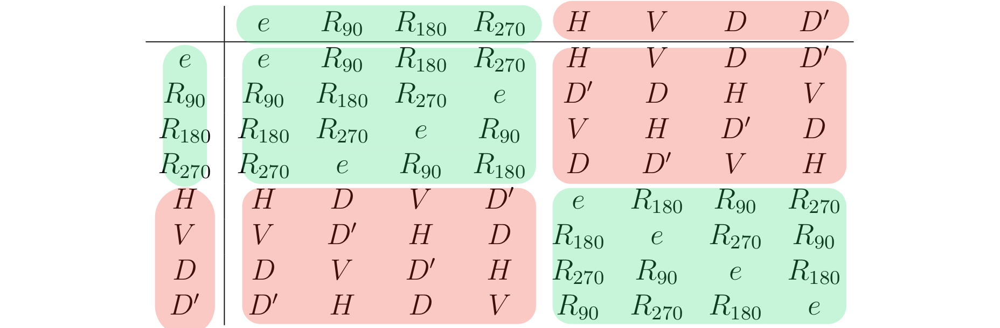
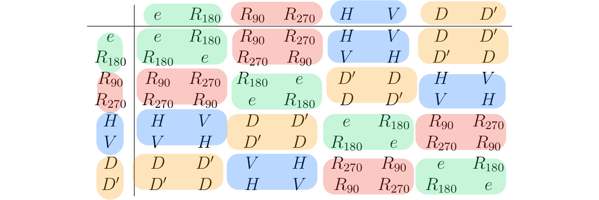

Let $G$ be a group and $H \le G$. Let $G/H$ be the set of all left cosets of $H$ in $G$.

Definition - $G/H$
: $G/H = \{ aH : a \in G\}$ is the set of all left cosets of $H$.

Q: Can we put an operation on $G/H$ to turn it into a group? How should we define $aH * bH$ for some $a,b \in G$?

We could define $aH * bH = abH$.

Q: Is this well-defined?

Any reasonable product on $G/H$ should not depend on how we represent the cosets. (i.e. if $aH = a’H$ and $bH = b’H$ , will we get that $aH * bH = a’H * b’H$?)

What would this mean for $H$?

If $h \in H$ and $a \in G$, then
$$\begin{aligned}
haH &= hH * aH \\\\ &= eH * aH  \\\\ &= eaH \\\\ &= aH \\\\
\end{aligned}$$
Thus, $haH = aH \; \forall h \in H \, a \in G$, so $Ha \subseteq aH \; \forall a\in G$.

By replacing $a$ with $a^{-1}$, we get $Ha^{-1} \subseteq a^{-1}H \; \forall a \in G$. Thus, $Ha \supseteq aH \; \forall a \in G$.

Therefore, $aH = Ha \; \forall a \in G$.

Summary: If we want to turn $G/H$ into a group with operation $aH * bH = abH$, then every left coset of $H$ is also a right coset!

## Normal Subgroups

Definition - Normal Subgroup
: Let $G$ be a group and $H \le G$. We say that $H$ is a
  **normal subgroup** of $G$ if $aH = Ha \; \forall a \in G$.
: Equibalently, by (6) of proposition 5.1, $H$ is normal if and only if
  $aHa^{-1} = H$.
: If $H$ is a normal subgroup of $G$, we write $H \trianglelefteq G$.

Remarks:

1. Not every subgroup will be normal (e.g. on A3, you showed that the group $\langle v \rangle \le D_4$ is not normal)
2. If $G$ is Abelian, the in fact every subgroup of $G$ will be normal (since $aH = Ha \; \forall a \in G$)
3. In part 6 of proposition 5.1, we showed that $aH = Ha \; \forall a \in G$ if an only if $aHa^{-1} = H \; \forall a \in G$

Alternatively, by (6) of proposition 5.1, $H$ is normal if and only if $aHa^{-1} = H$.

Our next result gives us an easier way to check if a subgroup is normal.

## Normal Subgroup Test

Theorem 6.1 - Normal Subgroup Test
: Let $G$ be a group and $H \le G$. Then $H \trianglelefteq G$
  if and only if $xHx^{-1} \subseteq H$ for all $x \in G$.

> Proof:
>
> If $H \trianglelefteq G$, then $xHx^{-1}=H$ for all $x \in G$, by (6) of Proposition 5.1. In particular, $xHx^{-1} \subseteq H$
>
> Conversely, suppose that $xHx^{-1} \subseteq H$ for all $x \in G$.
> If $a \in G$, then for $x=a$, we have $aHa^{-1} \subseteq H$,
> and hence by multiplying on the right by $a$, $aH \subseteq Ha$.
> Moreover, with $x=a^{-1}$, we have $a^{-1}Ha \subseteq H$, so $Ha \subseteq aH$. Therefore $aH=Ha \; \forall a \in G$, so $H \trianglelefteq G$.

In practice, Theorem 6.1 is used to test if a subgroup is normal.

### Example 1

Let $H= \{ r_k \in D_n: 0 \le k < n\}$ be a subgroup of $D_n$.
We claim $H \trianglelefteq D_n$.

Let $x \in D_n$ and $h \in H$. First, if $x$ is a rotation, then $xhx^{-1}$ is a rotation. Hence, $xhx^{-1} \in H$. Second, if $x$ is a flip, then $xhx^{-1} = h^{-1}$. (On A1 you showed that $fhf^{-1} = h^{-1}$ where $f$ is a flip). Hence, $xhx^{-1} \in H$.

Thus, $xHx^{-1} \subseteq H \; \forall x \in D_n$, so $H \trianglelefteq D_n$, by the normal subgroup test.

### Example 2

Let $A_n$ be the set of even permutations in $S_n$. We claim $A_n \trianglelefteq S_n$.

Let $\sigma \in A_n$ and $\tau \in S_n$. If $\tau$ is even, then so is $\tau^{-1}$, and hence $\tau \sigma \tau^{-1}$ is $(\text{even})(\text{even})(\text{even}) = (\text{even})$. Thus, $\tau \sigma \tau^{-1} \in A_n$. If instead, $\tau$ is odd, then so is $\tau^{-1}$, and hence $\tau \sigma \tau^{-1}$ is $(\text{odd})(\text{even})(\text{odd}) = (\text{even})$. Then $\tau \sigma \tau^{-1} \in A_n$.

By the normal subgroup test, $A_n \trianglelefteq S_n$.

Theorem 6.2
: Let $G$ be a group and $H \le G$. If $|G:H| = 2$, then $H \trianglelefteq G$.

> Proof:
>
> Since $|G:H|=2$, there are exactly 2 left cosets and 2 right cosets.
> The left cosets partition $G$, so they are $H$ and $\{g \in G: g \notin H\}$.
> Likewise, the right cosets are $H$ and $\{g \in G: g \notin H\}$, so if $a \in H$, then $aH = H = Ha$. But if $a \notin H$, then $aH \neq H$. Hence, $aH=\{g\in G: g \notin H\}$.
> Likewise, if $Ha \neq H$, then $Ha = \{g \in G : g \notin H\}$.
> Again, $Ha=aH$, so $H \trianglelefteq G$.

Note: The way to think about a normal subgroup $H$ is that the element of $H$ “almost commute” with every $a \in G$ (i.e. for all $h \in H$, we can “almost switch the order of $ah$, where $a \in G$). But it comes at the cost of possibly replacing $h$ with same other $h’$. That is $ah = h’a$. In some special cases, the element of $H$ does not change.

### Example 3

Let $G$ be a group. We define its **centre** $Z(G)$ to be $Z(G) = \{a \in G : ab=ba \; \forall b \in G\}$. On quiz 2, you proved that $Z(G) \le G$, but in fact it is normal.

If $a \in Z(G)$ and $b \in G$, then $bab^{-1} = bb^{-1}a = a \in Z(G)$. By the normal subgroup test, $Z(G) \trianglelefteq G$

Exercise: Show that $Z(S_n)=\{e\}$ for all $n \ge 3$.

Exercise: Show that $Z(D_4)=\{e, r_2\}$

To see that sometimes we do get $ah=h’a$ for $h \neq h’$, consider $A_4 \trianglelefteq S_4$. We have $(1 2 3) \in A_4$. We can’t write $(1 2)(1 2 3) = (1 2 3)(1 2)$. But we do have $(1 2)(1 2 3) = (1 3 2)(1 2)$

## Quotient Group

The real importance of a normal subgroup is in turning the left cosets  $G/H$ into a group.

Theorem 6.3 - Quotient Group
: Let $G$ be a group and $H \trianglelefteq G$. Then $G/H = \{ aH : a\in G\}$ is a group under the operation $aH \cdot bH = abH$.
: We call this group the **quotient** of $G$ by $H$ (or “ $G \mod H$ ”).

> Proof:
>
> We first check that this operation is well-defined. That is we will
> show that if $aH = a’H$ and $bH = b’H$, then $(aH)(bH) = (a’H)(b’H)$.
>
> We can write $a=a’h_1$ and $b=b’h_2$ for some $h_1 h_2 \in H$. Then
> $(aH)(bH) = abH = a’h_1 b’h_2 H = a’h_1 b’ H$. Since $H$ is normal,
> there exists $h_3 \in H$ such that $h_1 b’ = b’ h_3$. Thus, $(aH)(bH)
> = a’b’h_3H = a’b’H$. The operation is well-defined.
>
> The associativity of the operation comes from the associativity of
> the multiplication in $G$.
>
> The identity is $H$. First note that $H = eH$. Given $aH \in G/H$, we
> have $H \cdot aH = eH \cdot aH = (ea)H = aH$.
>
> The inverse of $aH \in G/H$ is $a^{-1}H$. Indeed $(aH)(a^{-1}) =
> (aa^{-1})H = eH = H$. Similarly, $(aH)(a^{-1}) = H$.

Remarks:

1. $H$ is the identity of $G/H$.
2. If an element $aH \in G/H$ has order $n$, this means that $a^n \in H$.
3. The order of $G/H$ is $|G:H|$, the number of left cosets. If $G$ is finite, by Lagrange’s theorem, $|G/H| = \frac{|G|}{|H|}$.

e.g. Let $G=\Z$ and $H=3\Z$. Is $H$ a normal subgroup? Yes, since $\Z$ is Abelian and $aH = Ha$.
The quotient is $\Z / 3\Z = \{ a + 3\Z : a \in \Z \} = \{0+3\Z, 1+3\Z, 2+3\Z\}$.
Recall that in the section 1, $a+3\Z = \{ a+3k: k \in Z\} = \{b \in \Z : 3 \mid (b-a)\} = [a]$.
Also, $(a+3\Z)(b+3\Z) = (a+b)+ 3\Z$. As groups, $\Z / 3\Z = \{[0], [1], [2]\} = \Z_3$.

In general, $\Z/ n\Z = Z_n$.

e.g. Last time we showed that $\{e, r_1, r_2, r_3\} = \langle r_1 \rangle$ is a normal subgroup of $D_4$. Let’s investigate $D_4/ \langle r_1 \rangle$. $|D_4/ \langle r_1 \rangle| = \frac{|D_4|}{|r_1|} = \frac{8}{4} = 2$. Our two cosets are $\{\langle r_1 \rangle, f \langle r_1 \rangle \}$.

|                       | $\langle r_1\rangle$ | $f\langle r_1\rangle$ |
|:---------------------:|:--------------------:|:---------------------:|
| $\langle r_1\rangle$  | $\langle r_1\rangle$ | $f\langle r_1\rangle$ |
| $f\langle r_1\rangle$ | $f\langle r_1\rangle$ | $\langle r_1\rangle$ |

We can see the Cayley table for $D_4/ \langle r_1 \rangle$ inside the table for $D_4$.

‌

e.g. Last time we said that $Z(G) \trianglelefteq G$ (recall $Z(G)$ is the center of $G$) and that $Z(D_4) = \{r_0, r_2\}$. Let’s investigate $D_4/Z(D_4)$. For convenience, let $\mathcal{K} = Z(D_4)$. $|D_4/\mathcal{K}| = \frac{|D_4|}{|\mathcal{K}|} = \frac{8}{2} = 4$. The elements are $\mathcal{K}$, $r_1\mathcal{K} = \{r_1, r_3\}$, $s_3\mathcal{K} = \{ s_3, s_1\}$, and $s_0\mathcal{K} = \{s_0, s_2\}$. Again we can write the Cayley table:

Once again, by rewriting the table for $D_4$ starting with $e$, we can see that Cayley table for $D_4/K$ as “block” in the Cayley table for $D_4$.

Exercise: Let $G$ be a group and $H \trianglelefteq G$. Prove that:

1. If $G$ is Abelian, so is $G/H$
2. If $G$ is cyclic, so is $G/H$

Theorem 6.4
: If $G$ is a group and $G/Z(G)$ is cyclic, then $G$ is Abelian.

> Proof:
>
> Suppose that $G/Z(G)$ is cyclic. Then $G/Z(G) = \langle gZ(G) \rangle = \{ g^iZ(G): i \in \Z\}$ for some $g \in G$. Let $a, b \in G$. Since $a$ and $b$ are in some cosets (possibly different ones), we can write $a=g^i z_1$ and $b=g^j z_2$ where $i,j \in \Z$ and $z_1, z_2 \in Z(G)$. Then $ab = (g^i z_1) (g^j z_2) = g^i g^j z_2 z_1 = (g^j z_2)(g^i z_1) = ba$. Hence $G$ is Abelian.

Exercise: Let $p$ be a prime and consider the group $D_p$. What is $Z(D_p)$?

Solution:

$|D_p|=2p$ and $Z(D_p) \le D_p$. The Lagrange’s theorem says that $|Z(D_p)|$ can be one of $1, 2, p, 2p$.

- If $|Z(D_p)| = 2p$, then $Z(D_p)= D_p$, but $D_p$ is not Abelian.
- If $|Z(D_p)| = p$, then $|D_p/Z(D_p)|=\frac{|D_p|}{|Z(D_p)|}=\frac{2p}{p}=2$. By corollary 5.5, since it has prime order, $D_p/Z(D_p)$ is cyclic. By theorem 6.4, $D_p$ is Abelian. Contradiction.
- If $|Z(D_p)| = 2$, then similarly $D_p/Z(D_p)$ is cyclic.

Thus $|Z(D_p)| = 1$.

Exercise: Let $G$ be a group of order $pq$ where $p, q$ are distinct primes. Prove that $Z(G)={e}$ or $G$ is Abelian.

Solution:

Since $Z(G) \trianglelefteq G$, by Lagrange, $|Z(G)|$ divides $|G| = pq$, so it is one of $1, p, q, pq$.

- If $|Z(G)| = 1$, then $Z(G) = \{e\}$. Done.
- If $|Z(G)| = p$, $|G/Z(G)| = \frac{|G|}{|Z(G)|} = q$. Since $q$ is prime, $G/Z(G)$ is cyclic. Thus $G$ is Abelian.
- If $|Z(G)| = q$, $|G/Z(G)| = p$, so similarly $G$ is Abelian.
- If $|Z(G)| = pq$, $Z(G) = G$. Thus $G$ is Abelian.

Theorem 6.5 - Cauchy’s Theorem for Abelian Groups
: If $G$ is a finite Abelian group and $p$ is prime that divides $|G|$, then there is an element in $G$ of order $p$.

> Proof: (induction on quotient groups)
>
> This result holds for any groups of order $2$. Assume that the result holds for all groups of order $< |G|$.
>
> First, we claim that $G$ has an element of prime order. Indeed, let $x\in G \setminus \{e\}$. Since $|x|>1$, we can write $|x|=m=qn$ where $q$ is a prime. Note that $|x^n| = \frac{|x|}{\gcd(|x|,n)} = \frac{qn}{\gcd(qn,n)} = \frac{qn}{n} = q$, so we have same element of prime order. It is safe to asusume that $|x|=q$.
>
> If $q=p$, then we are done. Otherwise, assume $q \neq p$. Consider the quotient group $G/\langle x \rangle$ (This is indeed a group, as $G$ is Abelian so $x \trianglelefteq G$). Note that $|G/\langle x \rangle|= \frac{|G|}{|x|} = \frac{|G|}{q}$, so $G/\langle x\rangle$ is a group with order smaller than $G$ and $p \mid |G/\langle x \rangle|$.
>
> Thus, by induction, there is some element $y\langle x \rangle$
> in $G\setminus\langle x\rangle$ of order $p$.
> That is, $y^p \langle x\rangle = \langle x \rangle$,
> so $y^p \in \langle x \rangle = \{e, x, x^2,... x^{q-1}\}$.
> Note that $y \neq e$, otherwise $|y\langle x \rangle|=1$.
>
> Case 1: If $y^p = e$, then $|y|$ divides $p$.
> Since $p$ is prime and $|y| \neq 1$, we have $|y|=p$. Done.
>
> Case 2: If $y^p \neq e$, then $y^p = x^k$ for some
> $k \in \{1,2,...,q-1\}$. $|y^p|=q$ as $|x|=q$ and $q$ is prime.
> We claim that $|y^q|=p$.
> Certainly, $(y^q)^p=(y^p)^q=e$, then $|y^q|$ divides $p$,
> and it is either $1$ or $p$ .
> If $|y^q|=1$, then
> $(y\langle x \rangle)^q = y^q\langle x \rangle=\langle x \rangle$,
> so $|y\langle x \rangle|=p$ divides $q$.
> This cannot happen as $p,q$ are distinct primes!
> Therefore, $|y^q|=p$.

Exercise: Prove that an Abelian group of order $33$ is cyclic.(Hint: Use Cauchy to find $a,b\in G$ with $|a|=3$, $|b|=11$. Then show that $|ab|=33$ and hence $G=\langle ab \rangle$.)

Solution:

By Cauchy, there are elements $a,b \in G$ such that $|a| = 3$ and $|b| = 11$.

Since $G$ is Abelian,
$$(ab)^{33} = a^{33} b^{33} = (a^3)^{11} (b^{11})^3 = e^{11} e^{3} = e$$
Thus, $|ab|$ divides $33$.

Also,
$$e = (ab)^{3|ab|} = (a^3)^{|ab|} b^{3|ab|}= b^{3|ab|}$$
Thus $11$ divides $3|ab|$, so $11$ divides $|ab|$. Similarly, $3$ divides $|ab|$. Hence, $33$ divides $|ab|$.

Therefore $|ab| = 33$. It follows that $\lang ab \rang = G$.

